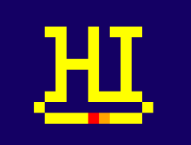

# MultiuserWireWorld

## Welcome!
This is a project utilizing a node.js webserver and web sockets to create an enviroment for multiple users to interact and build structure for a wireworld cellular automaton. 

## What is Wireworld? 
Wireworld is a celluar automaton, it exists on a grid and each cell is in one of four states:
* Empty
* Wire / Conductor (Yellow) 
* Electron Head (Red)
* Electron Tail (Orange)

It follows four basic rules each tick:

1. An empty cell stays empty
2. electron head (red) turns into an electron tail (orange)
3. electron tail turns into wire (yellow)
4. wire will turn into an electron head if one or two of its neighbors are electron heads, but not more

[Wireworld Wikipedia](https://en.wikipedia.org/wiki/Wireworld)

## Setup Instructions
1. `> git clone https://github.com/HSkalski/MultiuserWireWorld.git`
2. `> cd MultiUserWireWorld`
3. `> npm install`
4. `> mkdir boards`
5. Set up `/configs/keys.js` with your mongodb uri
6. `> npm start`

## //TODO

|Objective |Progress |
| ---      |  ---    |
|Drag Drawing| Funcional|
|Drag 'n Drop| First iteration copy paste is in|
|___Database Connection___| DB connected|
|DB Load/Save Boards| Database saving and incremental savingworking, loading working|
|oAuth2 googleSign in/up| Planned|
|Multiple simultanious Boards updating| Working|
|Better Pan / Zoom| Planned|
|Chat functionality|Planned|
|Intro / Rules List|Started|
| Tones based on state changes | Started, bug with tones piling up making one loud tone once loaded |

| Optimizations | |
| --- | --- |
|Only send the wires, heads, and tails instead of whole board grid, allows for larger board sizes, however worst case is still sending the whole board | Implemented |
| Send the difference in boards, send whole board every once in a while to account for desync | Planned |
| offload logic to client, send less data, only sending sync frames in case of inconsistency|  |

| Longer Term Goals | |
| --- | --- |
| Expand user functionality | dont list boards, instead join by a code for collaboration |
